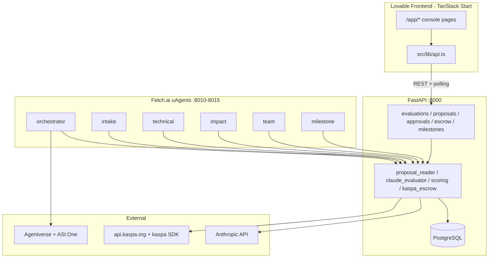

# ARGOS Architecture

## System Overview



## Repository Layout

```
/workspace/
├── docs/                    # Memory & reference docs
├── backend/
│   ├── api/                 # FastAPI app, routes, models, schemas
│   ├── services/            # Business logic shared by API + agents
│   ├── agents/              # Fetch.ai uAgents
│   ├── demo/                # Demo scripts + sample proposals
│   ├── alembic/             # DB migrations
│   └── requirements.txt
└── src/                     # TanStack Start frontend
    ├── lib/api.ts           # Typed API client
    └── routes/              # Marketing + console pages
```

## Data Flow — Evaluation Pipeline

1. User creates evaluation round via `POST /api/evaluations`
2. Proposals uploaded via `POST /api/proposals/batch` (PDF/URL/text)
3. `proposal_reader` extracts text; Claude extracts structure
4. User triggers `POST /api/evaluations/{id}/run`
5. Background task runs technical + impact + team scoring in parallel per proposal
6. Scores aggregated, proposals ranked
7. Frontend polls `GET /api/evaluations/{id}/status`
8. Human reviewer approves/overrides via `/api/approvals/*`
9. Winner selected → `POST /api/escrow/create`
10. Milestone submissions verified → funds released via Kaspa

## Design Decisions

- **FastAPI is source of truth** for DB and business logic
- **uAgents** call same `services/` modules; expose Agentverse/ASI:One interface
- **PostgreSQL** for persistence; SQLite fallback for local dev without Docker
- **React Query** for frontend polling and optimistic updates
